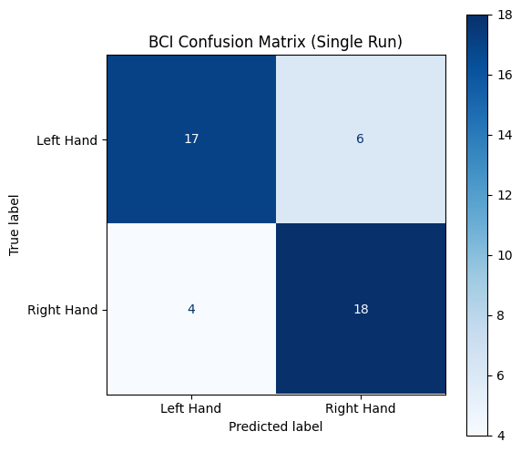
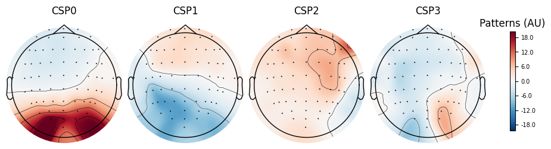

# EEG Motor Imagery BCI Decoder — CSP + LDA Baseline

A reproduction of the classic BCI Competition baseline architecture (Common Spatial Patterns → Linear Discriminant Analysis) on PhysioNet EEGBCI data, with spatial and temporal validation of what the classifier actually learned.

**Dataset:** PhysioNet EEGBCI (`eegmmidb`), Subject 1, runs 4/8/12 — imagined left vs. right fist movement. 45 trials, 64 channels @ 160 Hz, fetched automatically via MNE's built-in downloader.

**Method:** CSP (4 components, Ledoit-Wolf regularised) → LDA, evaluated with 5-fold × 10-repeat stratified cross-validation and a permutation test.

---

## Summary
The pipeline reaches **71.6% ± 15.6%** against a 51.1% majority-class baseline, significant by permutation test. Taken alone, that number reads as a working motor imagery decoder. 

<p align="center">
  
</p>

It isn't one.

Plotting the CSP spatial patterns shows the most discriminative component weighted over **occipital cortex**, not the sensorimotor strip — no C3/C4 lateralisation of the kind motor imagery produces.

<p align="center">
  
</p>

Three ablation tests follow:

| Test | Result |
|---|---|
| Drop 9 occipital/parieto-occipital channels | 71.6% → 61.1% (paired Wilcoxon *p* = 0.0003) |
| Late window (2.5–4.0 s), duration matched at 1.5 s | 69.8% → 51.8%, at chance |
| Occipital alpha asymmetry by cue side | Direction consistent with hemifield attention; underpowered |

The discriminative signal is **posterior, cue-locked, and does not persist through the trial** — the opposite profile to sustained mu desynchronisation. The EEGBCI protocol displays a lateralised visual target during the imagery period, making attention to that cue the leading explanation, though *n* = 45 is too small to establish it.[cite: 2]

**The result is negative, and deliberately so:** the accuracy is real, its source is not sustained sensorimotor activity, and no amount of classifier tuning would have revealed that. Only spatial and temporal validation did.[cite: 2]

---

## Running it
## Running it

**Google Colab** (recommended — the notebook was developed there):

[](https://colab.research.google.com/github/adeelms/EEG-Motor-Imagery-BCI-Decoder/blob/main/EEG-Motor-Imagery-BCI-Decoder.ipynb)

Click the badge above and run all cells. The first cell installs MNE if absent and downloads the dataset (~7 MB) automatically. Total runtime is a few minutes.

**Locally:**

```bash
git clone https://github.com/adeelms/EEG-Motor-Imagery-BCI-Decoder.git
cd EEG-Motor-Imagery-BCI-Decoder
pip install -r requirements.txt
jupyter notebook EEG-Motor-Imagery-BCI-Decoder.ipynb
```

No manual data download is needed. MNE fetches the EDF files from PhysioNet on first run and caches them (`~/mne_data` by default).

**Reproducibility:** all outputs in the committed notebook come from a single clean run — execution counts read 1, 2, 3, 4, so every figure and number corresponds to the code directly above it.
---

## Structure

| Phase | Contents |
|---|---|
| 1 | Data fetch, montage, 8–30 Hz bandpass, epoching (0.5–2.5 s post-cue) |
| 2–3 | CSP + LDA pipeline, repeated CV, permutation test, confusion matrix |
| 4 | CSP spatial patterns, component-order verification, topographic inspection |
| 5 | Confound analysis — spatial, temporal, and directional ablations |

---

## Methodological notes

- **CSP is supervised**, so both steps live inside a scikit-learn `Pipeline`. Fitting CSP before cross-validation leaks test-fold labels into the spatial filters and inflates accuracy substantially. This is the most common methodological error in BCI reproductions.
- **Only `patterns_` (forward model) is interpreted anatomically**, never `filters_`. A filter may load heavily on a channel purely to cancel noise; only the pattern describes how a source projects onto the scalp. See Haufe et al., 2014, *NeuroImage* 87:96–110.
- **Component indexing is verified empirically rather than assumed.** MNE's `CSP` defaults to `component_order='mutual_info'`, which reorders eigenvectors by discriminability so `transform()` uses indices `[0,1,2,3]` — not the two-from-each-end convention in textbook CSP descriptions. Phase 4 asserts this against `transform()` output rather than trusting it.
- **Temporal ablation holds duration constant.** Comparing a 2.0 s window against a 1.5 s one would confound "the effect decayed" with "the covariance estimate got noisier." Both windows in Test 2 are 1.5 s / 241 samples, and trial counts are printed to confirm nothing was silently dropped at run boundaries.
- **Fold-level statistics are paired.** Test 1 uses the same CV object and `random_state` for both conditions, so fold *i* is the same split in each, and the difference is tested with a Wilcoxon signed-rank test. Note that repeated-CV folds share training data, making the p-value anti-conservative.
- **Spread is reported with every mean.** With 9-trial test folds, accuracy is quantised in steps of 1/9 (11 percentage points), so single-split numbers are unstable by construction.

---

## Limitations

- **Single subject, 45 trials.** Confidence intervals are wide. BCI illiteracy — subjects producing no usable motor imagery signal — affects an estimated 15–30% of people, so a null for Subject 1 is a property of that subject (or of the task design), not of the method.
- **No artefact removal.** No ICA, no EOG regression, no automated bad-channel or bad-epoch rejection. Ocular and muscular activity remain in the data, and no claim of artefact independence is made anywhere.
- **The confound is not fully identified.** Test 3 is directionally consistent with lateralised visual attention but does not survive correction across three electrode pairs. A global alpha or arousal difference time-locked to cue onset remains a competing explanation.
- **Permutation test resolution.** Run at *n* = 100, giving a floor of 1/101 ≈ 0.0099. The reported value sits at that floor, so the result should be read as *p* < 0.01 rather than as a point estimate.

---

## Next steps

1. **Run across all 109 subjects** and report the distribution of accuracies rather than a single number. This is the single highest-value extension — it would establish whether the posterior, cue-locked effect is specific to Subject 1 or systematic across the dataset.
2. Add ICA-based EOG removal and re-run the full validation chain.
3. Restrict to sensorimotor channels (FC/C/CP rows) and compare against the full montage.
4. Add a deep-learning baseline (EEGNet / ShallowConvNet) under an identical CV scheme.
5. Quantify ERD directly via Morlet time-frequency analysis at C3/C4 with a pre-cue baseline — measures the physiology with no classifier in the loop.

---

## References

- Schalk, G., et al. (2004). BCI2000: A general-purpose brain-computer interface system. *IEEE Transactions on Biomedical Engineering*, 51(6), 1034–1043. — EEGBCI dataset.
- Goldberger, A., et al. (2000). PhysioBank, PhysioToolkit, and PhysioNet. *Circulation*, 101(23), e215–e220.
- Haufe, S., et al. (2014). On the interpretation of weight vectors of linear models in multivariate neuroimaging. *NeuroImage*, 87, 96–110.
- Blankertz, B., et al. (2008). Optimizing spatial filters for robust EEG single-trial analysis. *IEEE Signal Processing Magazine*, 25(1), 41–56.
- Gramfort, A., et al. (2013). MEG and EEG data analysis with MNE-Python. *Frontiers in Neuroscience*, 7, 267.
